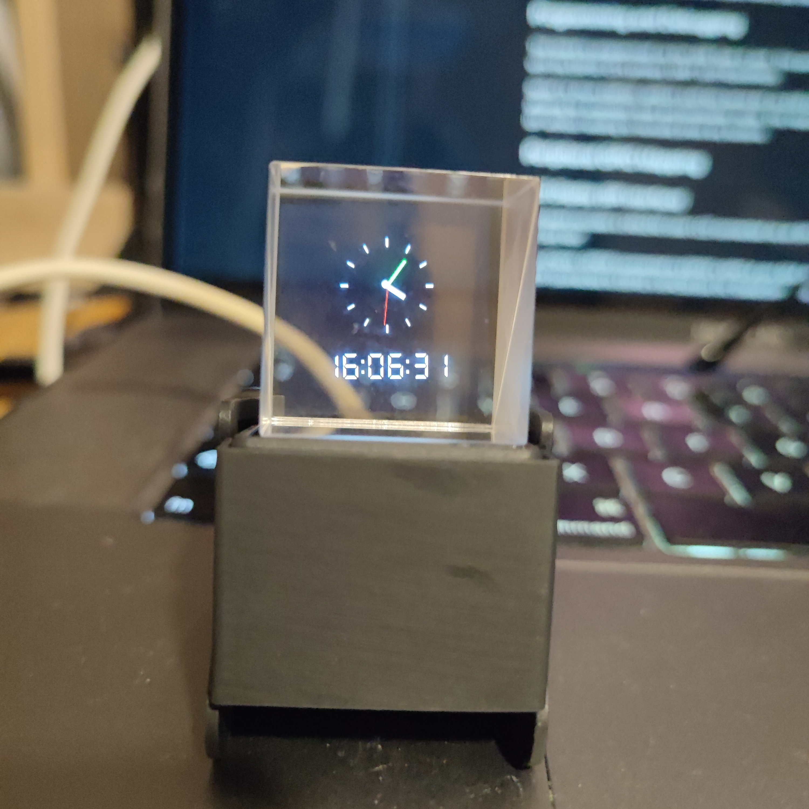

# ESP32-C3 LVGL Clock Example


[Demo Video](https://youtube.com/shorts/b9oFKSKzzGA?feature=share)

## Overview
This project is a minimal digital and analog clock for the ESP32-C3 board, using a 240x240 ST7789 SPI LCD and the LVGL v9 graphics library. The clock synchronizes time via WiFi and NTP, and displays both a digital (7-segment style) and analog clock face using the DSEG7_Classic_Mini font.

## Features
- Digital and analog clock display (LVGL v9)
- WiFi NTP time synchronization (with Athens DST auto-adjust)
- Uses DSEG7_Classic_Mini font for digital display
- Designed for ESP32-C3 with ST7789 240x240 SPI LCD

## Pin Assignments (as used in this program)
| Function         | ESP32-C3 GPIO | Notes                |
|------------------|--------------|----------------------|
| TFT_CS (CS)      | GPIO2        | LCD Chip Select      |
| TFT_DC (DC)      | GPIO3        | LCD Data/Command     |
| TFT_RST (Reset)  | GPIO8        | LCD Reset            |
| TFT_SCLK (SCL)   | GPIO4        | SPI Clock            |
| TFT_MOSI (SDA)   | GPIO7        | SPI Data Out (MOSI)  |

> **Note:** Other peripherals (SD card, IMU, battery ADC, onboard LED) are not used by this program.

## How it Works
- On boot, the ESP32-C3 connects to WiFi and fetches the current time from an NTP server.
- The time is displayed both as a digital clock (using a 7-segment font) and as an analog clock (drawn with LVGL objects).
- The display is mirrored horizontally for correct orientation.
- Daylight Saving Time (DST) for Athens is handled automatically.

## Usage
1. Edit the WiFi credentials in `3dClock.ino`:
   ```cpp
   const char* ssid     = "YOUR_SSID";
   const char* password = "YOUR_PASSWORD";
   ```
2. Compile and upload using Arduino CLI:
   ```sh
   ./upload.sh
   ```
   This script will compile, upload, and open the serial monitor automatically.

## Font: DSEG7_Classic_Mini
The DSEG7_Classic_Mini font is included and used for the digital clock display. It is licensed under the SIL Open Font License, Version 1.1.

## Dependencies
- LVGL v9.x
- Adafruit GFX Library
- Adafruit ST7735 and ST7789 Library
- WiFi, NTPClient libraries (for time sync)

---
For more details, see the comments in `3dClock.ino`.